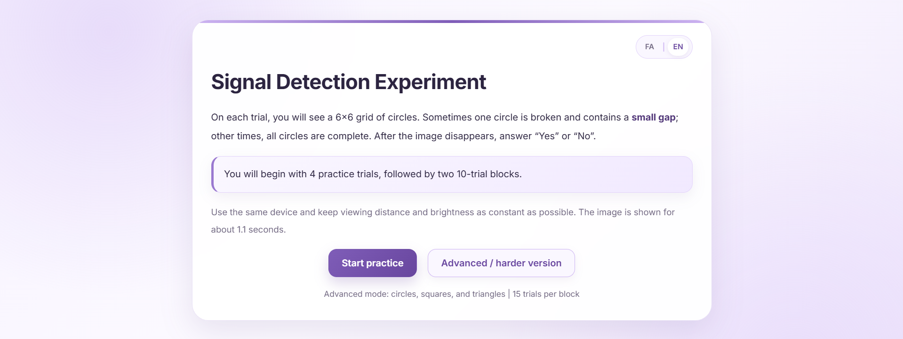

## Signal Detection Experiment 🧠

A bilingual, interactive web experiment based on **Signal Detection Theory (SDT)** that explores how reward and punishment can influence decision criterion. 
The project includes a standard visual detection task and a more challenging version with mixed geometric shapes.

🔗 **[Click here to view the live project](https://bahareh-bahrami.github.io/Signal-Detection-Experiment/)** 
 

---

### 🚀 Features

- Persian and English interface
- Standard SDT task with broken-circle detection
- Advanced mode with circles, squares, and triangles
- 4 practice trials with immediate visual feedback
- Visual progress bar for each block
- Reward and punishment condition
- Automatic calculation of **Hit Rate, False Alarm Rate, d′, and c**
- Comparison of performance between the two experimental blocks
- Trial-by-trial and summary CSV export
- Responsive design for desktop, tablet, and mobile

---

### 🛠️ Technologies Used

- **HTML5**
- **CSS3**
- **JavaScript (ES6+)**
- **Canvas API**
- **Responsive Design Principles**

---

### 📚 What I Learned

- Translating Signal Detection Theory concepts into an interactive browser experiment
- Separating perceptual sensitivity (**d′**) from decision criterion (**c**)
- Designing randomized visual-search trials
- Recording and comparing behavioral responses across experimental conditions
- Building a bilingual RTL/LTR interface
- Creating a responsive and user-friendly experimental UI

---

